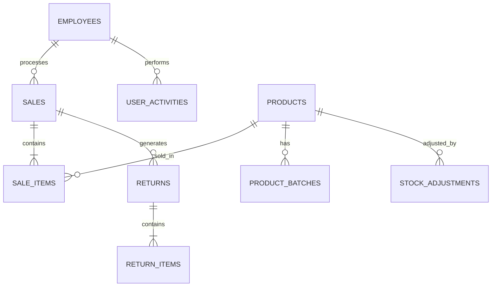

## High-level architecture

The BMS POS system is built as a modern desktop application using a client-server architecture:

```
┌─────────────────────────────────────────────────────────────┐
│                     Electron Desktop App                    │
│  ┌────────────────────────────────────────────────────────┐ │
│  │              React Frontend (Vite)                     │ │
│  │  • TypeScript 5.9 • React 19 • Tailwind CSS 4.1      │ │
│  │  • React Router • shadcn/ui components                │ │
│  └────────────────────┬───────────────────────────────────┘ │
│                       │ IPC / HTTP                          │
│  ┌────────────────────▼───────────────────────────────────┐ │
│  │          Electron Main Process (Node.js)              │ │
│  │  • Window Management • Printing • Hardware Access     │ │
│  └────────────────────┬───────────────────────────────────┘ │
└────────────────────────┼───────────────────────────────────┘
                         │ HTTP/REST API
                         ▼
        ┌────────────────────────────────────┐
        │    .NET 8 Web API (ASP.NET Core)  │
        │  • RESTful Endpoints               │
        │  • Entity Framework Core 9.0       │
        │  • BCrypt Authentication           │
        │  • Serilog Structured Logging      │
        └────────────┬───────────────────────┘
                     │ Npgsql 9.0
                     ▼
        ┌────────────────────────────────────┐
        │   PostgreSQL 13+ (via Supabase)   │
        │  • 14 Tables                       │
        │  • Row-level Security              │
        │  • Real-time Subscriptions         │
        └────────────────────────────────────┘
```

## Frontend architecture

### Technology stack

| Component | Technology | Version | Purpose |
|-----------|------------|---------|----------|
| **Framework** | React | 19.1.1 | UI component library |
| **Language** | TypeScript | 5.9.2 | Type-safe development |
| **Build Tool** | Vite | 7.1.4 | Fast bundling and HMR |
| **Styling** | Tailwind CSS | 4.1.12 | Utility-first CSS |
| **Desktop** | Electron | 37.3.0 | Native desktop wrapper |
| **Routing** | React Router | 7.2.0 | Client-side navigation |
| **UI Components** | shadcn/ui | - | Accessible component system |

### Component structure

The frontend is organized into feature-based components:

```text
src/frontend/
├── App.tsx                      # Main app with routing
├── components/
│   ├── Login.tsx                # Authentication screen
│   ├── POS.tsx                  # Point of Sale interface (1022 lines)
│   ├── Dashboard.tsx            # Manager dashboard
│   ├── Manager.tsx              # Manager control panel
│   ├── Inventory.tsx            # Product management
│   ├── SalesHistory.tsx         # Transaction history
│   ├── Returns.tsx              # Return/refund processing
│   ├── Reports.tsx              # Business analytics
│   ├── Employees.tsx            # Employee management
│   ├── TaxSettings.tsx          # Tax configuration
│   ├── SystemSettings.tsx       # System preferences
│   ├── ReceiptPreview.tsx       # Receipt display modal
│   └── ui/                      # Reusable UI components
├── contexts/
│   └── SettingsContext.tsx      # Global settings state
├── utils/
│   ├── ApiClient.ts             # HTTP client wrapper
│   ├── SessionManager.ts        # Session/auth management
│   ├── formatCurrency.ts        # Currency formatting
│   └── receiptFormatter.ts      # Receipt text generation
└── types/
    └── SystemSettings.ts        # TypeScript interfaces
```

(src: `src/frontend/`)

### Key frontend features

<AccordionGroup>
  <Accordion title="Real-time barcode scanning">
    The POS component includes a sophisticated barcode scanner detection system:

    ```typescript
    // Barcode scanner detection (keyboard event listener)
    React.useEffect(() => {
      const handleKeyDown = (e: KeyboardEvent) => {
        if (kbOpen || (e.target as HTMLElement).tagName === 'INPUT') return
        
        if (e.key.length === 1) {
          setScanBuffer(prev => prev + e.key)
        }
        
        const timeout = setTimeout(() => {
          const fullBarcode = scanBuffer + e.key
          if (fullBarcode.length >= 5) {
            searchByBarcode(cleanBarcode)
          }
          setScanBuffer('')
        }, 100) // 100ms timeout for fast barcode input
      }
      
      document.addEventListener('keydown', handleKeyDown)
      return () => document.removeEventListener('keydown', handleKeyDown)
    }, [kbOpen, scanBuffer])
    ```

    (src: `src/frontend/components/POS.tsx:182-218`)
  </Accordion>

  <Accordion title="Session management">
    Secure session handling with automatic expiration:

    - Sessions stored in `sessionStorage` (cleared on window close)
    - Automatic logout after inactivity
    - Business action extends session (e.g., completing a sale)
    - Session guards protect routes requiring authentication

    (src: `src/frontend/utils/SessionManager.ts`)
  </Accordion>

  <Accordion title="Touch-optimized UI">
    Designed for touchscreen POS terminals:

    - Large tap targets (minimum 44x44px)
    - On-screen keyboard for PIN/text entry
    - Modal keyboards with numeric, decimal, and QWERTY layouts
    - Gesture-friendly card-based interface
    - Responsive grid layouts for product catalogs

    (src: `src/frontend/components/ModalKeyboard.tsx`, `src/frontend/components/HybridInput.tsx`)
  </Accordion>

  <Accordion title="Inventory validation">
    Real-time stock checking prevents overselling:

    ```typescript
    const addToCart = (product: Product) => {
      const existingItem = cart.find(item => item.product.id === product.id)
      
      // Check stock limits before adding
      if (existingItem) {
        if (existingItem.quantity >= product.stockQuantity) {
          alert(`Cannot add more ${product.name}. Only ${product.stockQuantity} available.`)
          return
        }
      } else {
        if (product.stockQuantity <= 0) {
          alert(`${product.name} is out of stock.`)
          return
        }
      }
      
      // Add to cart if validation passes
      setCart(currentCart => { /* ... */ })
    }
    ```

    (src: `src/frontend/components/POS.tsx:308-337`)
  </Accordion>
</AccordionGroup>

## Backend architecture

### Technology stack

| Component | Technology | Version | Purpose |
|-----------|------------|---------|----------|
| **Framework** | ASP.NET Core | 8.0 | Web API framework |
| **ORM** | Entity Framework Core | 9.0.12 | Database abstraction |
| **Database Driver** | Npgsql | 9.0.4 | PostgreSQL .NET driver |
| **Authentication** | BCrypt.Net | 0.1.0 | PIN hashing |
| **Logging** | Serilog | 9.0.1 | Structured logging |
| **Documentation** | Swashbuckle | 7.3.0 | Swagger/OpenAPI |

### API structure

```text
BMS_POS_API/
├── Program.cs                   # Application entry point & DI config
├── Controllers/
│   ├── AuthController.cs        # Login & authentication
│   ├── SalesController.cs       # Sales transactions & reports
│   ├── ProductsController.cs    # Product CRUD operations
│   ├── EmployeesController.cs   # Employee management
│   ├── ReturnsController.cs     # Return/refund processing
│   ├── TaxSettingsController.cs # Tax configuration
│   ├── SystemSettingsController.cs # System preferences
│   ├── UserActivityController.cs   # Activity logging
│   └── StockAdjustmentsController.cs # Inventory adjustments
├── Models/                      # Entity models (13 models)
│   ├── Employee.cs
│   ├── Product.cs
│   ├── Sale.cs
│   ├── SaleItem.cs
│   └── ...
├── Data/
│   └── BmsPosDbContext.cs      # EF Core database context
├── Services/                    # Business logic services
│   ├── IUserActivityService.cs
│   ├── IPinSecurityService.cs
│   └── IMetricsService.cs
└── Migrations/                  # EF Core database migrations
```

(src: `BMS_POS_API/`)

### Core API endpoints

<CodeGroup>

```http Authentication
POST /api/auth/login
# Authenticate user with Employee ID and PIN
# Returns employee data and session token

POST /api/auth/validate-manager
# Validate manager PIN for approvals
```

```http Sales
GET  /api/sales
# List all completed sales

POST /api/sales
# Create new sale transaction

GET  /api/sales/today
# Get today's sales summary

GET  /api/sales/top-products?days=7
# Get best-selling products

GET  /api/sales/employee-performance
# Get employee sales metrics
```

```http Products
GET  /api/products
# List all active products

GET  /api/products/barcode/{barcode}
# Find product by barcode

POST /api/products
# Create new product

PUT  /api/products/{id}
# Update product details
```

```http Inventory
GET  /api/products/low-stock
# Get products below min stock level

POST /api/stock-adjustments
# Record stock adjustment

POST /api/inventory-counts
# Start physical inventory count
```

</CodeGroup>

### Authentication flow

The authentication system supports both legacy plaintext PINs and modern hashed PINs with automatic upgrades:

```csharp
private bool IsValidPin(string storedPin, string providedPin)
{
    // Check if stored PIN is legacy (plaintext)
    if (_pinSecurityService.IsLegacyPin(storedPin))
    {
        bool isValid = storedPin == providedPin;
        
        // If valid, upgrade to hashed PIN in background
        if (isValid)
        {
            _ = Task.Run(async () => await UpgradeLegacyPinAsync(storedPin, providedPin));
        }
        
        return isValid;
    }
    else
    {
        // Modern hashed PIN verification using BCrypt
        return _pinSecurityService.VerifyPin(providedPin, storedPin);
    }
}
```

(src: `BMS_POS_API/Controllers/AuthController.cs:190-211`)

### Sales transaction processing

Sales are processed atomically with automatic inventory updates:

<Steps>
  <Step title="Validate employee and products">
    Ensure employee exists and all products have sufficient stock
  </Step>
  
  <Step title="Generate transaction ID">
    Format: `TXN-YYYYMMDD-XXXXXXXX` (date + random 8-char hex)
  </Step>
  
  <Step title="Create sale record">
    Insert sale with totals, tax, discount, and payment details
  </Step>
  
  <Step title="Create sale items">
    Insert line items for each product with quantities and prices
  </Step>
  
  <Step title="Update inventory">
    Decrement stock quantities for all sold products
  </Step>
  
  <Step title="Log activity">
    Record user activity with sale details for audit trail
  </Step>
</Steps>

(src: `BMS_POS_API/Controllers/SalesController.cs:64-160`)

## Database architecture

### Entity Relationship Diagram



### Database tables

The system uses 14 PostgreSQL tables with snake_case naming:

<AccordionGroup>
  <Accordion title="employees - User accounts">
    ```sql
    CREATE TABLE employees (
        id SERIAL PRIMARY KEY,
        employee_id VARCHAR(50) UNIQUE NOT NULL,
        pin VARCHAR(255) NOT NULL,  -- BCrypt hashed
        name VARCHAR(255),
        role VARCHAR(50),  -- 'Manager', 'Cashier', 'Inventory'
        is_manager BOOLEAN DEFAULT FALSE,
        is_active BOOLEAN DEFAULT TRUE,
        created_date TIMESTAMP NOT NULL,
        last_updated TIMESTAMP
    );
    ```

    **Default employee**: `0001` / `1234` (Manager)
  </Accordion>

  <Accordion title="products - Product catalog">
    ```sql
    CREATE TABLE products (
        id SERIAL PRIMARY KEY,
        barcode VARCHAR(255) UNIQUE NOT NULL,
        name VARCHAR(255) NOT NULL,
        description TEXT,
        price DECIMAL(18,2) NOT NULL,
        cost DECIMAL(18,2) NOT NULL,
        stock_quantity INT DEFAULT 0,
        min_stock_level INT DEFAULT 0,
        variant VARCHAR(255),
        brand VARCHAR(255),
        category VARCHAR(255),
        image_url TEXT,
        unit VARCHAR(50) DEFAULT 'pcs',
        is_active BOOLEAN DEFAULT TRUE,
        created_date TIMESTAMP NOT NULL,
        last_updated TIMESTAMP
    );
    ```
  </Accordion>

  <Accordion title="sales - Transaction headers">
    ```sql
    CREATE TABLE sales (
        id SERIAL PRIMARY KEY,
        transaction_id VARCHAR(100) UNIQUE NOT NULL,
        employee_id INT REFERENCES employees(id),
        sale_date TIMESTAMP NOT NULL,
        subtotal DECIMAL(18,2) NOT NULL,
        tax_rate DECIMAL(5,2) DEFAULT 0,
        tax_amount DECIMAL(18,2) DEFAULT 0,
        discount_amount DECIMAL(18,2) DEFAULT 0,
        discount_reason VARCHAR(255),
        total DECIMAL(18,2) NOT NULL,
        amount_paid DECIMAL(18,2) NOT NULL,
        change DECIMAL(18,2) DEFAULT 0,
        payment_method VARCHAR(50) DEFAULT 'Cash',
        status VARCHAR(50) DEFAULT 'Completed',
        notes TEXT
    );
    ```
  </Accordion>

  <Accordion title="sale_items - Transaction line items">
    ```sql
    CREATE TABLE sale_items (
        id SERIAL PRIMARY KEY,
        sale_id INT REFERENCES sales(id),
        product_id INT REFERENCES products(id),
        quantity INT NOT NULL,
        unit_price DECIMAL(18,2) NOT NULL,
        line_total DECIMAL(18,2) NOT NULL,
        product_name VARCHAR(255),  -- Snapshot at time of sale
        product_barcode VARCHAR(255)
    );
    ```
  </Accordion>

  <Accordion title="returns - Return transactions">
    ```sql
    CREATE TABLE returns (
        id SERIAL PRIMARY KEY,
        return_id VARCHAR(100) UNIQUE NOT NULL,
        original_sale_id INT REFERENCES sales(id),
        employee_id INT REFERENCES employees(id),
        return_date TIMESTAMP NOT NULL,
        total_refund DECIMAL(18,2) NOT NULL,
        refund_method VARCHAR(50),
        reason TEXT,
        status VARCHAR(50) DEFAULT 'Completed'
    );
    ```
  </Accordion>

  <Accordion title="user_activities - Audit trail">
    ```sql
    CREATE TABLE user_activities (
        id SERIAL PRIMARY KEY,
        employee_id INT REFERENCES employees(id),
        username VARCHAR(255),
        action VARCHAR(500) NOT NULL,
        details TEXT,
        entity_type VARCHAR(100),
        entity_id INT,
        action_type VARCHAR(50),  -- 'LOGIN', 'SALE', 'UPDATE', etc.
        ip_address VARCHAR(50),
        timestamp TIMESTAMP NOT NULL
    );
    ```
  </Accordion>

  <Accordion title="stock_adjustments - Inventory changes">
    ```sql
    CREATE TABLE stock_adjustments (
        id SERIAL PRIMARY KEY,
        product_id INT REFERENCES products(id),
        adjustment_type VARCHAR(50),  -- 'Manual', 'Restock', 'Damage', etc.
        quantity_change INT NOT NULL,
        reason TEXT,
        adjusted_by INT REFERENCES employees(id),
        adjustment_date TIMESTAMP NOT NULL
    );
    ```
  </Accordion>

  <Accordion title="system_settings - Configuration">
    ```sql
    CREATE TABLE system_settings (
        id SERIAL PRIMARY KEY,
        business_name VARCHAR(255),
        business_address TEXT,
        business_phone VARCHAR(50),
        business_logo_path TEXT,
        default_payment_method VARCHAR(50) DEFAULT 'Cash',
        available_payment_methods TEXT DEFAULT 'Cash,Card,ETF/Digital',
        show_receipt_preview BOOLEAN DEFAULT TRUE,
        require_manager_approval_for_discount BOOLEAN DEFAULT FALSE,
        auto_logout_minutes INT DEFAULT 30
    );
    ```
  </Accordion>
</AccordionGroup>

(src: `BMS_POS_API/Data/BmsPosDbContext.cs`)

### Database connection

The system connects to PostgreSQL via Supabase using Npgsql:

```csharp
// Connection string format (from environment variables)
var connectionString = $"Host={host};Port={port};Database={database};Username={username};Password={password};SSL Mode=Require;Trust Server Certificate=true";

services.AddDbContext<BmsPosDbContext>(options =>
    options.UseNpgsql(connectionString));
```

**Environment variables** (`.env`):
```bash
BMS_DB_USER=postgres
BMS_DB_PASSWORD=your_password
BMS_DB_SERVER=your-project.supabase.co
BMS_DB_PORT=5432
BMS_DB_NAME=postgres
```

(src: `BMS_POS_API/Program.cs`, `.env.example`)

## Electron integration

### Main process architecture

The Electron main process handles:

1. **Window management** - Multi-display support, kiosk mode
2. **Printing** - Direct thermal printer integration via escpos
3. **Hardware access** - Barcode scanners, receipt printers, cash drawers
4. **IPC communication** - Bridge between renderer and Node.js APIs
5. **API configuration** - Runtime API URL configuration

(src: `src/electron/main.js`)

### Multi-display support

The system intelligently selects the target display:

```javascript
// Priority 1: --display=<index> command line argument
// Priority 2: BMS_DISPLAY_INDEX environment variable
// Fallback: Smallest display by area (ideal for secondary touchscreen)

const displayArg = process.argv.find(arg => arg.startsWith('--display='));
const envDisplayIndex = process.env.BMS_DISPLAY_INDEX;

if (displayArg) {
  targetDisplay = displays[parseInt(displayArg.split('=')[1])];
} else if (envDisplayIndex) {
  targetDisplay = displays[parseInt(envDisplayIndex)];
} else {
  targetDisplay = displays.reduce((smallest, d) => 
    (d.bounds.width * d.bounds.height < smallest.bounds.width * smallest.bounds.height) ? d : smallest
  );
}
```

**Usage**:
```bash
npm run display0  # Use primary display
npm run display1  # Use secondary display
npm run display2  # Use tertiary display
```

(src: `src/electron/main.js:63-106`, `package.json`)

### IPC endpoints

Electron exposes Node.js APIs to the renderer via IPC:

```javascript
// Preload script exposes APIs to renderer
contextBridge.exposeInMainWorld('electronAPI', {
  validateLogin: (employeeId, pin, role) => ipcRenderer.invoke('validate-login', { employeeId, pin, role }),
  validateManagerPin: (pin) => ipcRenderer.invoke('validate-manager-pin', pin),
  printReceipt: (receiptText, logoPath) => ipcRenderer.invoke('print-receipt', receiptText, logoPath),
  openExternal: (url) => shell.openExternal(url)
});
```

(src: `src/electron/preload.js`)

## Security architecture

### PIN security

- **Hashing algorithm**: BCrypt with auto-generated salt
- **Legacy support**: Automatic upgrade from plaintext to hashed PINs
- **Background upgrade**: Non-blocking PIN hash migration
- **Minimum length**: 4 digits (configurable)

```csharp
public class PinSecurityService : IPinSecurityService
{
    public string HashPin(string plainTextPin)
    {
        return BCrypt.Net.BCrypt.HashPassword(plainTextPin);
    }

    public bool VerifyPin(string plainTextPin, string hashedPin)
    {
        return BCrypt.Net.BCrypt.Verify(plainTextPin, hashedPin);
    }

    public bool IsLegacyPin(string pin)
    {
        // Legacy PINs are typically 4-6 digits, BCrypt hashes are 60 chars
        return pin.Length < 20;
    }
}
```

(src: `BMS_POS_API/Services/PinSecurityService.cs`)

### Activity logging

All user actions are logged to the `user_activities` table:

- Login/logout events
- Sale transactions
- Inventory modifications
- Settings changes
- Failed authentication attempts

Each log includes:
- Employee ID and name
- Action type and details
- Entity type and ID (product, sale, etc.)
- IP address
- Timestamp (UTC)

(src: `BMS_POS_API/Services/UserActivityService.cs`)

### Session security

- Sessions stored in `sessionStorage` (cleared on window close)
- Automatic expiration after configurable inactivity period
- No persistent tokens (requires re-login)
- Session validation on protected routes

## Performance optimizations

<CardGroup cols={2}>
  <Card title="Fast product search" icon="magnifying-glass">
    - In-memory filtering of active products
    - Debounced search input (300ms)
    - Indexed barcode lookups in PostgreSQL
    - Client-side product caching
  </Card>
  
  <Card title="Optimized database queries" icon="database">
    - EF Core query optimization
    - Eager loading with `.Include()`
    - Indexed foreign keys
    - Date-based query filtering
  </Card>
  
  <Card title="React performance" icon="react">
    - `React.memo` for expensive components
    - `useMemo` for filtered/sorted lists
    - Virtual scrolling for large datasets
    - Lazy route-based code splitting
  </Card>
  
  <Card title="Vite build optimization" icon="bolt">
    - Tree-shaking unused code
    - Code splitting by route
    - Minification and compression
    - Hot Module Replacement (HMR)
  </Card>
</CardGroup>

## Deployment architecture

### Development environment

```bash
# Terminal 1: Start .NET API
cd BMS_POS_API
dotenv -- dotnet watch run
# → Runs on http://localhost:5002

# Terminal 2: Start Vite dev server
npm run dev
# → Runs on http://localhost:3001

# Terminal 3: Start Electron
npm run electron:dev
# → Opens desktop app

# OR: Use the combined script
./scripts/dev.sh  # Starts all three services
```

### Production build

```bash
# Build React app
npm run build-react

# Build .NET API
cd BMS_POS_API
dotnet publish -c Release -o ./publish

# Package Electron app
npm run package  # Creates platform-specific installers
```

### System requirements

- **OS**: Windows 10/11, macOS 11+, or Linux (Ubuntu 20.04+)
- **CPU**: Dual-core 2.0 GHz or better
- **RAM**: 4 GB minimum (8 GB recommended)
- **Disk**: 500 MB for application + database size
- **Display**: 1024x768 minimum (1920x1080 recommended for POS terminals)
- **Network**: Required for PostgreSQL connection
- **Peripherals** (optional):
  - USB barcode scanner (HID keyboard mode)
  - Thermal receipt printer (ESC/POS compatible)
  - Cash drawer (connected via printer)

## Next steps

<CardGroup cols={2}>
  <Card title="API Reference" icon="code" href="/api-reference">
    Detailed documentation of all REST API endpoints
  </Card>
  
  <Card title="Configuration" icon="gear" href="/configuration">
    Configure system settings, taxes, and payment methods
  </Card>
  
  <Card title="Database Schema" icon="database" href="/database">
    Complete database schema with all tables and relationships
  </Card>
  
  <Card title="Deployment" icon="rocket" href="/deployment">
    Production deployment guide and best practices
  </Card>
</CardGroup>
